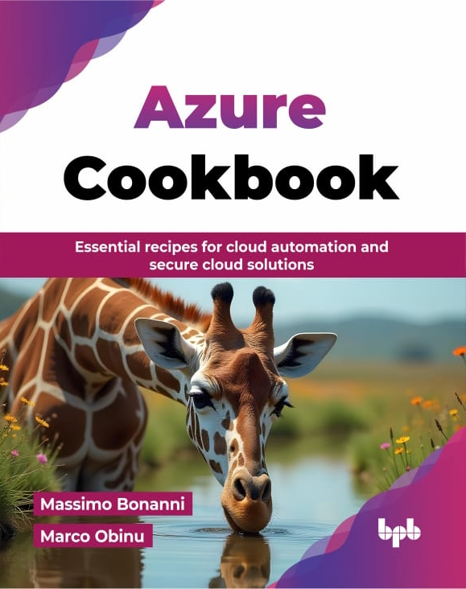

----

## 🚀 About Me

I'm Azure Technical Trainer at Microsoft and I spend my job time helping customers to empower their Azure skills to achieve more and leverage the power of Azure better in their solutions.

I'm also a technical speaker both for local and international events and a user-group guy.

I'm passionate about biking, reading, and dogs!!

----

----

## 🔗 Links

    &nbsp;&nbsp;
    &nbsp;&nbsp;
    &nbsp;&nbsp;
    &nbsp;&nbsp;
    &nbsp;&nbsp;
        

----

## :speech_balloon: Technical Sessions

### 2025

#### February

    <a href="https://github.com/massimobonanni/massimobonanni/blob/master/technicalsessions/20250221.md">  21/02/2025 - A.I. Day 2025 Roma - Personalizza la tua AI: model fine-tuning con i tuoi dati in Azure OpenAI</a>

    <a href="https://github.com/massimobonanni/massimobonanni/blob/master/technicalsessions/20250214.md">  14/02/2025 - Live Coding - Live Coding: alla scoperta di Microsoft.Extensions.AI</a>

#### January

    <a href="https://github.com/massimobonanni/massimobonanni/blob/master/technicalsessions/20250125.md">  25/01/2025 - .NET Saturday Pordenone - Microsoft.Extensions.AI: un API per domarli tutti!!!</a>

    <a href="https://github.com/massimobonanni/massimobonanni/blob/master/technicalsessions/20250110.md">  10/01/2025 - Bonanni a Tutti - Ignite ed ignoto</a>

### Previous years
#### [2024 -->](TechnicalSessions2024.md)
#### [2023 -->](TechnicalSessions2023.md)
#### [2022 -->](TechnicalSessions2022.md)
#### [2021 -->](TechnicalSessions2021.md)
#### [2020 -->](TechnicalSessions2020.md)

----

## :books: Books

<table>
<tr>
        <td width="300" align="center" valign="top">
            
        </td>
        <td rowspan="2" valign="top">
            "Azure Cookbook" is a practical guide designed to help developers, system administrators, and cloud architects master Microsoft Azure through hands-on solutions. This book offers step-by-step recipes for tackling real-world challenges using Azure’s vast range of services.
             
            This book covers many important topics related to Azure, such as storage, networking, virtual machines, containers, and application development. It offers practical tips and step-by-step instructions for creating and managing secure Azure applications. You will learn about various Azure services, including Azure Storage, Virtual Networks, App Service, and Azure Security Center. Whether you are new to Azure or have some experience, this guide will help you gain the skills needed to use Azure effectively for your cloud computing projects.
             
            With this book, you will not only enhance your Azure skills but also apply them directly to your job roles. By mastering the cloud, you will be equipped to design, deploy, and manage robust, scalable solutions-making you an invaluable asset in today’s cloud-driven world.
        </td>
    </tr>
    <tr>
        <td align="left" valign="top">
            Publication date: <b>October 2025</b>
             
            Publisher: <b>BPB Online</b>
             
            Pages: <b>616</b>
             
            ISBN: <b>9789365890198</b>
        </td>
    </tr>
    <tr height=50>
<tr>
        <td width="300" align="center" valign="top">
            
        </td>
        <td rowspan="2" valign="top">
            Durable Functions is an Azure Functions extension that implements triggers and bindings that abstract and manage state persistence. 
             
            Using Durable Functions, you can easily create stateful objects entirely managed by the extension.  
            Azure Durable Functions Succinctly author Massimo Bonanni will take readers from a recap of Azure Functions through Durable entities so that you can determine if this technology is right for your needs.
        </td>
    </tr>
    <tr>
        <td align="left" valign="top">
            Publication date: <b>January 2022</b>
             
            Publisher: <b>Syncfusion</b>
             
            Pages: <b>101</b>
             
            ISBN: <b>978-1-64200-221-8</b>
        </td>
    </tr>
    <tr height=50>
    <tr/>
    <tr>
        <td width="300" align="center" valign="top">
            
        </td>
        <td rowspan="2" valign="top">
            Application development has evolved from traditional monolithic app development to using serverless options and microservices. This book is designed to guide you through using Microsoft's Azure Functions to process data, integrate systems, and build simple APIs and microservices.
             
            You will discover how to apply serverless computing to speed up deployment and reduce downtime. You'll also explore Azure Functions, including its core functionalities and essential tools, along with understanding how to debug and even customize Azure Functions. In addition to this, the book will take you through how you can effectively implement DevOps and automation in your working environment. Toward the concluding chapters, you'll cover some quick tips, troubleshooting techniques, and real-world serverless use cases that will help you make the most of serverless computing.
             
            By the end of this book, you will have gained the skills you need to develop and deliver cost-effective Azure serverless solutions.
        </td>
    </tr>
    <tr>
        <td align="left" valign="top">
            Publication date: <b>November 2019</b>
             
            Publisher: <b>Packt</b>
             
            Pages: <b>362</b>
             
            ISBN: <b>9781789951226</b>
        </td>
    </tr>
</table>

-----

## :eyes: Repositories visitors

